# Mentis

**Mentis** is a real-time collaborative coding interview and pair-programming platform that combines live video calls, a shared code editor, chat, and session management — all in one place.
It is designed to simulate real technical interview environments while remaining lightweight, developer-friendly, and extensible.

👉 [Visit Mentis](https://mentis-0unb.onrender.com/)

---

## Features

* **Real-time video calls** using Stream Video
* **Live chat** integrated per session
* **Collaborative code editor** (Monaco Editor)
* **Problem-based sessions** with difficulty levels
* **Theme system** powered by Tailwind + DaisyUI
* **Authentication with Clerk**
* **Session history & activity tracking**
* **Fast, modern UI** built with React + Vite

---

## Tech Stack

### Frontend

* **React 19** + **Vite**
* **Tailwind CSS v4** + **DaisyUI**
* **Monaco Editor**
* **TanStack React Query**
* **Lucide React (icons)**

### Backend

* **Node.js** + **Express**
* **MongoDB** + **Mongoose**
* **Clerk Authentication**
* **Stream Video & Chat**
* **Inngest** (background/event workflows)

---

## Project Structure

```txt
.
├── backend
│   ├── src
│   │   ├── controllers        # Business logic (sessions, chat)
│   │   ├── routes             # API routes
│   │   ├── models             # MongoDB schemas
│   │   ├── middleware         # Auth & route protection
│   │   ├── lib                # DB, env, Stream, Inngest
│   │   └── server.js          # App entry point
│
├── frontend
│   ├── src
│   │   ├── components         # Reusable UI components
│   │   ├── pages              # App routes (Dashboard, Themes, Problems)
│   │   ├── hooks              # React Query + Stream hooks
│   │   ├── context            # Theme context
│   │   ├── api                # API clients
│   │   ├── lib                # Utilities & integrations
│   │   └── data               # Problem definitions
│   └── vite.config.js
│
└── package.json               # Monorepo scripts
```

---

## Authentication Flow

* User authentication is handled by **Clerk**
* Backend middleware (`protectRoute`) maps Clerk users to MongoDB users
* Session ownership and participation are enforced server-side

---

## Session Flow

1. User creates a session (problem + difficulty)
2. Backend creates:

   * Stream video call
   * Stream chat channel
   * MongoDB session record
3. Other users can join if the session is active
4. Host can end the session (video + chat cleanup)
5. Session is marked as completed

---

## Themes

* Themes are powered by **DaisyUI**
* User-selected theme is stored in `localStorage`
* Accessible via `/themes`
* Applied globally using `data-theme`

---

## Environment Variables

### Backend (`backend/.env`)

```env
# utils
PORT = xxx
NODE_ENV = development || production
CLIENT_URL: xxx

# DB 
MONGODB_URI = xxx

# INNGEST background jobs
INNGEST_EVENT_KEY = xxx
INNGEST_SIGNING_KEY = xxx

# GETSTREAM video calling and chat
STREAM_API_KEY = xxx
STREAM_API_SECRET = xxx

# CLERK
CLERK_PUBLISHABLE_KEY = xxx
CLERK_SECRET_KEY = xxx

```

### Frontend (`frontend/.env`)

```env
VITE_CLERK_PUBLISHABLE_KEY=xxx
VITE_API_URL = xxx
VITE_STREAM_API_KEY = xxx
```

---

## Running Locally

### 1️⃣ Clone the repo

```bash
git clone https://github.com/SS-Sanjay-Kumar/Mentis.git
cd Mentis
```

### 2️⃣ Install dependencies

```bash
npm install
```

This installs dependencies for both `frontend` and `backend`.

---

### 3️⃣ Start backend

```bash
npm run dev --prefix backend
```

Backend runs on `http://localhost:3000`.

---

### 4️⃣ Start frontend

```bash
npm run dev --prefix frontend
```

Frontend runs on `http://localhost:5173`.

---

## Screenshots

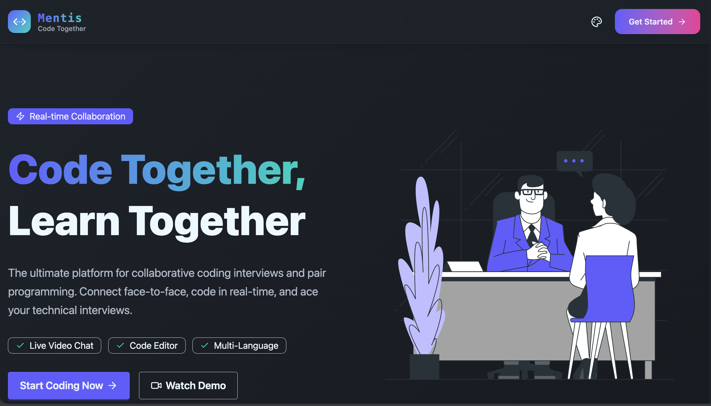
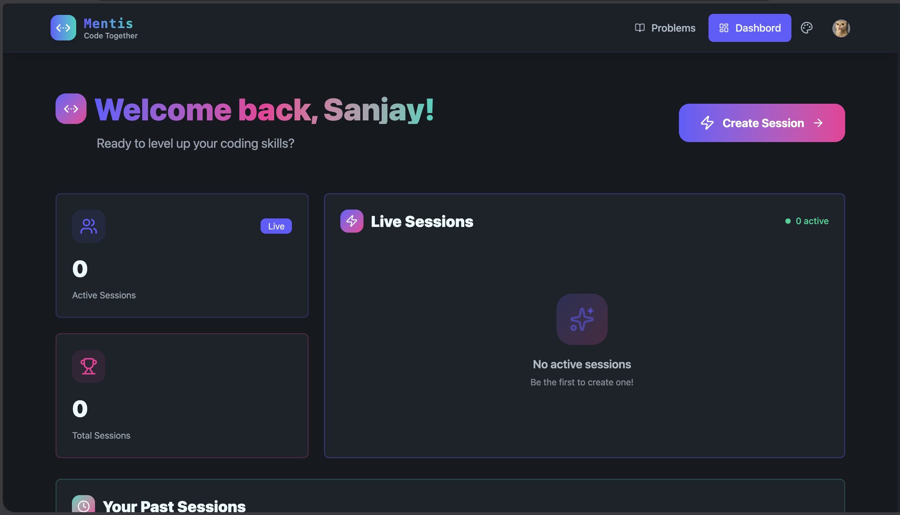
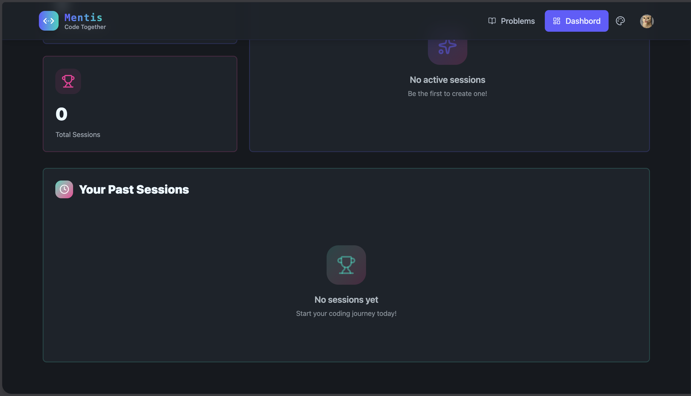
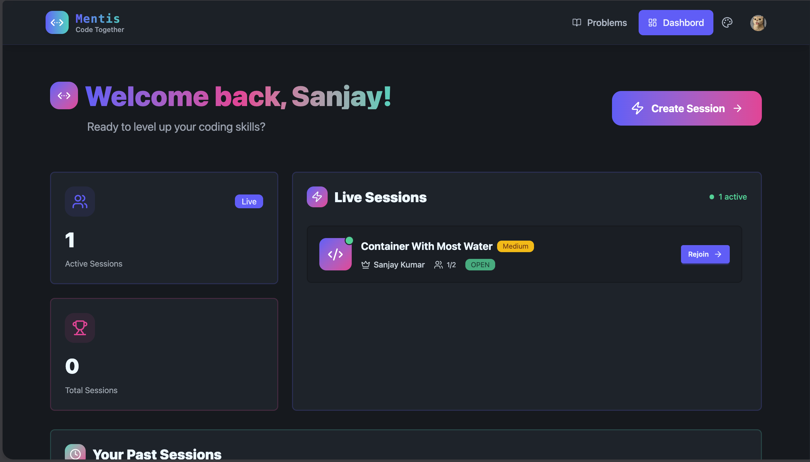
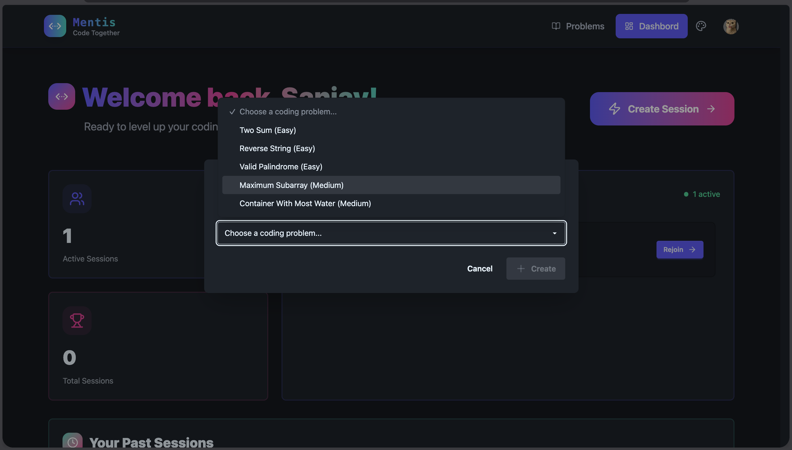
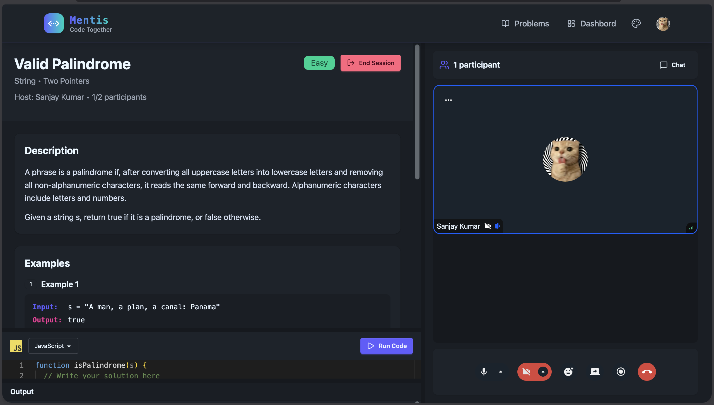
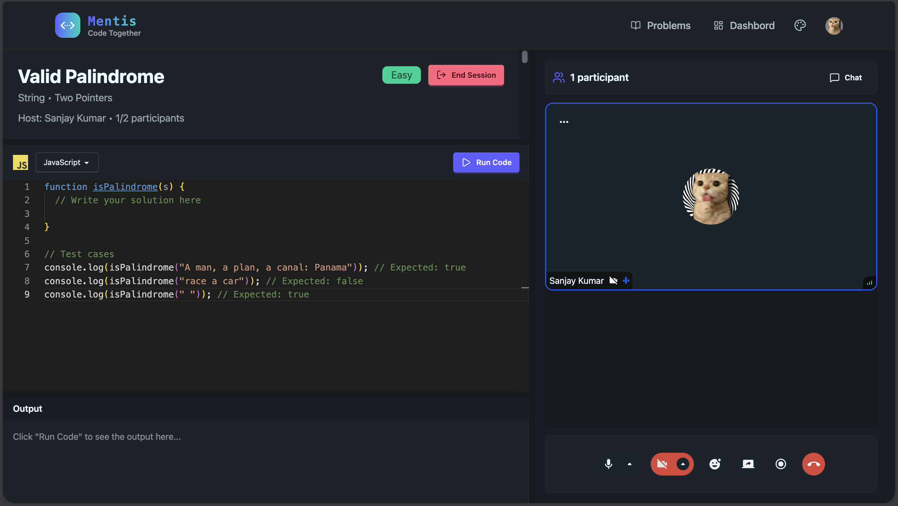
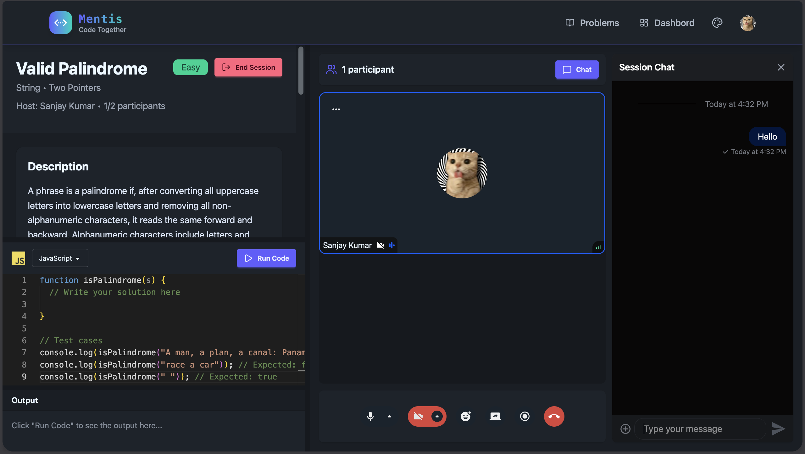
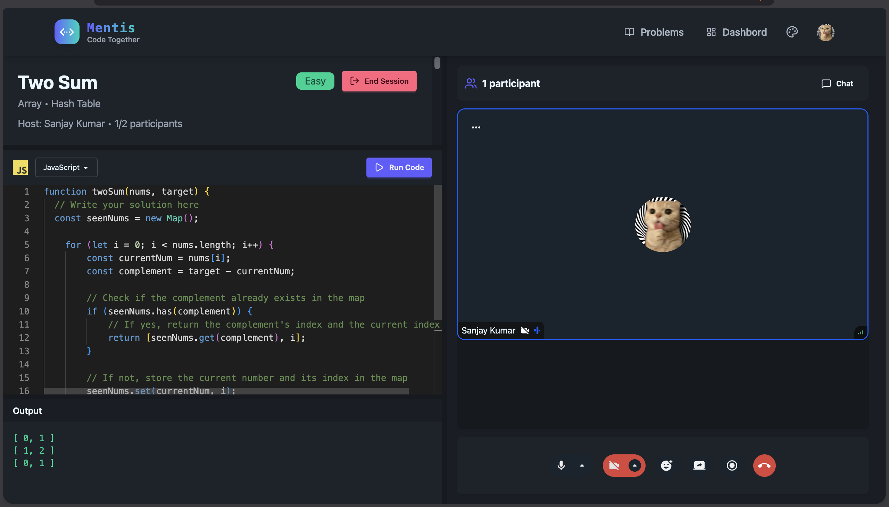
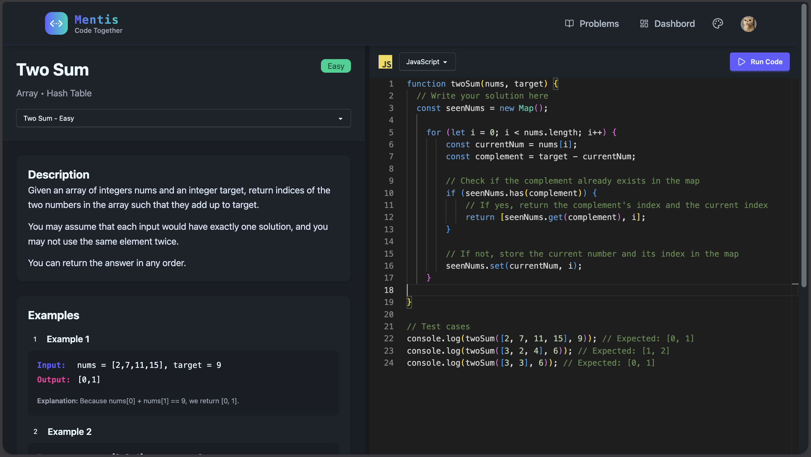
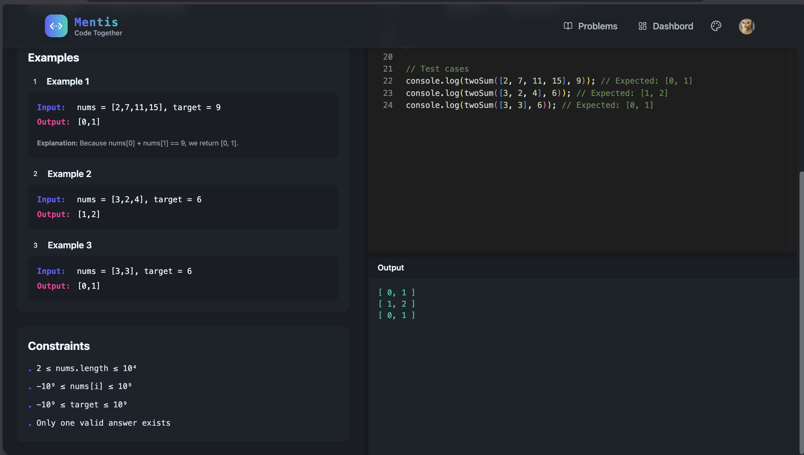
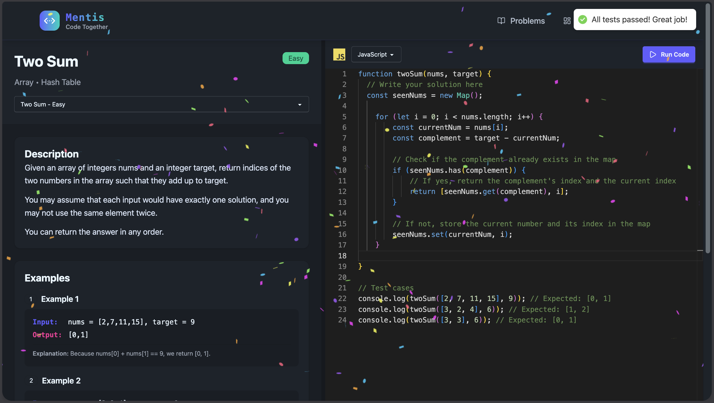
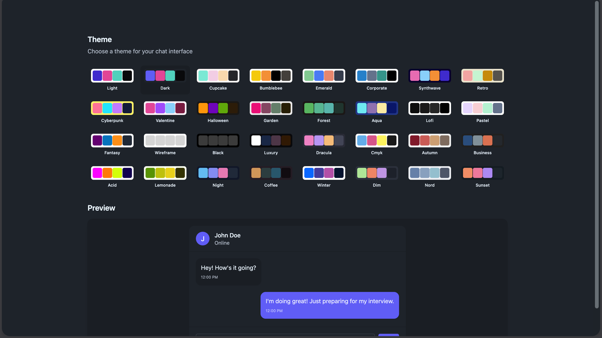
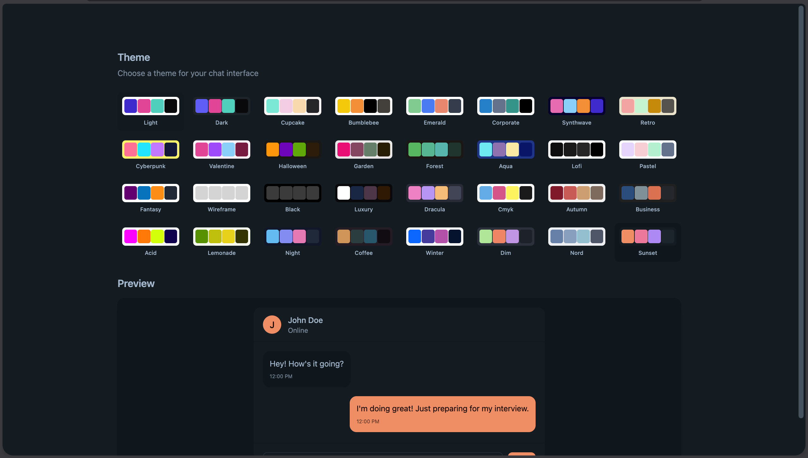
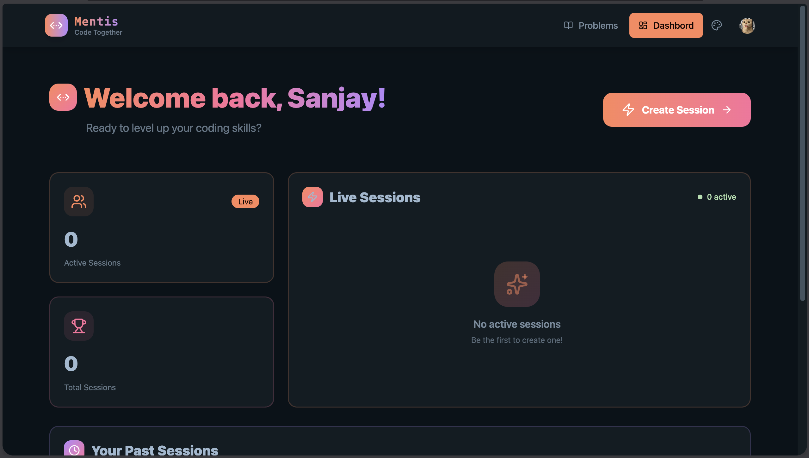
---

## Roadmap

* [ ] Role-based sessions (interviewer / candidate)
* [ ] Code execution per language
* [ ] Session recording
* [ ] Public problem contributions
* [ ] Analytics & insights per session
